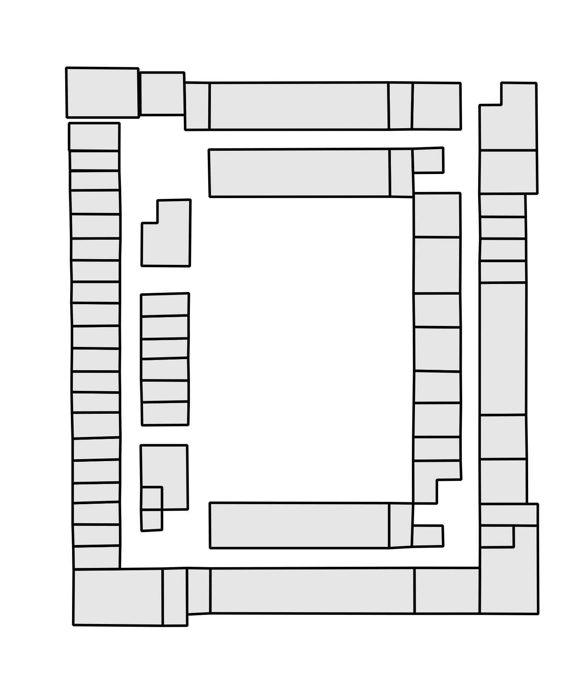

# UCLA Maps backend

UCLA Maps is the mobile app built by UCLA Student Media that helps students navigate their way around campus and discover what's around them; the app is available in the [App Store](https://itunes.apple.com/us/app/ucla-maps/id1284271661) and in [Google Play](https://play.google.com/store/apps/details?id=com.uclastudentmedia.UCLAMaps). 

This backend powers the API that our [apps' frontend](https://github.com/uclastudentmedia/tours-frontend) uses, and the crown jewel of our APIs is **indoor navigation**: the ability to navigate from one room to another in the same building. Given user input of a specific building, a start room, and end room, the API can generate an image (or two, if the rooms are on different floors) of the floor plan(s) with the path from the start to the end room. To see this in action, check out the apps or visit https://tours.bruinmobile.com/.

### Why build indoor navigation?

We built the indoor navigation API specifically for Boelter Hall and the Math Sciences building, to help alleviate the pain of finding room locations within these two buildings. Even experienced UCLA students have trouble finding their classroom in the winding 9-floor maze of Boelter/MS: which section of the building is my room in? Which entrance do I take? Where are Boelter and MS connected?

### Designing the user experience

Our ideal user experience would have been: given the user's GPS coordinates, whether they're inside or outside the building, provide real-time turn-by-turn navigation details for them to walk towards a destination room. This would have meant knowing the GPS coordinates for all the rooms in a building, and even if that were obtainable, there would've been a bigger problem: there's no cell signal when you're trapped under several floors of concrete, and the WiFi signal is also weak in the depths of Boelter, the Birthplace of the InternetTM, so there's no way you're getting accurate GPS location. Then there would also be the issue of determining which floor the user's on, and it turns out phones can determine altitude, but that'd be opening up another can of worms...

So we ended up making something simpler: if the user is currently inside a classroom or nearby one, they could enter that as the start room and enter the destination room that they want, and get an image or two showing the path to take to get to the destination room (this does assume that the user knows how to follow the path shown).

## Implementing the whole thing

Unlike outdoor navigation, which includes services like Google Maps and OpenStreetMap, there's not as much existing libraries and other support for indoor navigation, so we did our best to leverage existing libraries, glue them together, and write our own code when we needed to.

First, we needed to obtain floor plans for Boelter/MS and put that data into some format that would allow us to query it in order to do routing from one room to another: this ended up being a Postgres database with [PostGIS](https://postgis.net/), which lets us represent the rooms and pathways as geographic objects that we can do location queries on. Basically, the rooms/pathways become a huge graph that you can run your favourite shortest-distance algorithm on.

Then, when the user makes an API request for a specific building and start and end room, the server generates the graph of the entire building (luckily, we didn't have that much data), calculates the navigation route, and then uses that route data to generate the image(s) of the floor(s) to show the route.

Let's dive into the development process.

### Getting the data

As you might imagine, there's no public source of all floor plans for the buildings we wanted. Luckily, UPE was generous enough to provide us with a few floor plans with room labels (thanks UPE!), but for the rest of the floors, we walked around the floors looking for a labeled floor plan or just finding a floor layout and manually going around to label all the room numbers.

Since we didn't have a consistent source of floor plan images, there was no good way of automating the process of putting the floor plan data into the database. We thought it might be possible to use computer vision to detect the rooms in the images, but decided it would be too difficult and take too long. So, we ended up loading the images into [QGIS](https://qgis.org/en/site/) and manually tracing all the room locations, from which we could generate a clean looking floor plan image, like the one below from Boelter 4. 

We also added the walkable areas as paths, a collection of nodes and edges that make up the graph to navigate on. The rooms are added to this graph as one of the nodes in this graph. The graph data is shown superimposed on the rooms below:

This room and walkway data is then exported into the PostGIS database. A room is represented as a polygon with a series of coordinates, where the coordinates are the points' pixel locations in the floor plan image. A walkway is represented as a pair of these such coordinates, and a room's location in the graph is represented as one of the points of the walkways. The elevators' and stairs' locations were also added in the same fashion. With this data, we now have the locations of the rooms to do routing with, and pixel locations to draw the rooms and walkways at.

### Routing and drawing

We used the Python package [NetworkX](https://networkx.github.io/) to find the route from the start to the destination room. When the server gets a routing API request, it first generates the entire building's graph by getting all of the walkways in the building (luckily, we don't have _that_ much data in one building). To connect the stair and elevator points of different floors, the server adds edges in the graph between the corresponding stairs and elevators of adjacent floors, with the edge weight being a large value, just in case, to prevent the routing algorithm from doing something wacky like going up one set of stairs and down another set of stairs to end up at the same floor. Then, after querying the location of the start and end rooms, we can use NetworkX's Djikstra's implementation to find the shortest route between those two points, even if they are on two different floors (we also tried their A* implementation, but it was much slower, likely because A* is complicated, and the implementation had to do extra database queries). The routing algorithm returns a list of pathways that constitute the route along with the floors that they're on.

Given this list, we can now generate the images showing the route. We used [Pillow](https://pillow.readthedocs.io/en/5.1.x/) to load the base floor plan images, and knowing the pixel locations of the rooms and pathways, we colour in the start and end rooms and draw lines for the paths. We then save the images to files and return their URLs for the frontend to load. Here's what the final result of a route that starts and ends on different floors looks like:

 

## Wrapping it up

As you can see, the process for generating routing images is quite intensive.
